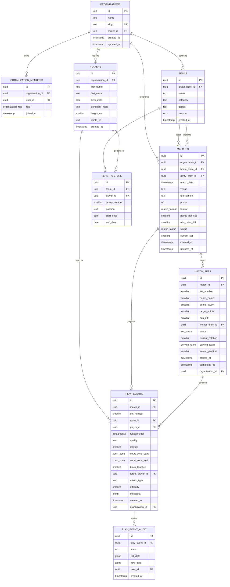

# Esquema de Base de Datos - Spike Stats

## Diagrama ER (Mermaid)

## Enums

| Enum | Valores | Descripción |
|------|---------|-------------|
| `organization_role` | `owner`, `admin`, `coach`, `parent`, `viewer` | Roles dentro de una organización |
| `match_status` | `scheduled`, `in_progress`, `completed`, `abandoned` | Estado del partido |
| `match_format` | `best_of_3`, `best_of_5` | Formato de sets |
| `fundamental` | `serve`, `reception`, `attack`, `block`, `set`, `defense` | Fundamentos de voleibol |
| `serve_quality` | `ace`, `in_play`, `error` | Calidad de saque |
| `reception_quality` | `excellent`, `positive`, `negative`, `error` | Calidad de recepción |
| `attack_quality` | `kill`, `in_play`, `error` | Calidad de ataque |
| `block_quality` | `kill`, `touch`, `assisted`, `error` | Calidad de bloqueo |
| `set_quality` | `assist`, `error` | Calidad de colocación |
| `defense_quality` | `dig`, `error` | Calidad de defensa |
| `set_status` | `pending`, `in_progress`, `completed` | Estado del set |
| `serving_team` | `home`, `away` | Equipo que sirve |
| `court_zone` | `1` - `18` (smallint) | Zonas de cancha FIVB |

## Tablas Principales

### organizations
Entidad raíz para multitenancy. Cada organización es completamente aislada via RLS.

### organization_members
Relación usuarios-organizaciones con roles. Unique constraint en (organization_id, user_id).

### teams
Equipos dentro de una organización. Categoría, género y temporada para filtrado.

### players
Perfil de jugadoras. Sin team_id directo - la relación va vía team_rosters para histórico.

### team_rosters
Asignación jugador-equipo por temporada. Dorsal único por (team_id, jersey_number, start_date).

### matches
Partidos programados. Metadatos completos: fecha, venue, torneo, fase, formato, puntos por set.

### match_sets
Sets de cada partido. Marcador derivado (points_home, points_away) actualizado por trigger.
Estado de rotación y servidor para sincronía multi-dispositivo.

### play_events
**Tabla central** - Evento único por acción de juego. Discriminador `fundamental` + `quality`.
Inmutable (hard delete + audit log). Coordenadas opcionales (zonas 1-18).

### play_event_audit
Historial inmutable de eventos eliminados. Append-only via trigger AFTER DELETE.

## RPCs (Funciones)

### get_player_match_stats(p_match_id, p_player_id)
Estadísticas completas de un jugador en un partido:
- Recepción: totales, por calidad, rating ponderado (3/2/1/0)
- Ataque: totales, kills, errores, eficiencia (kills-errors)/totales
- Bloqueo: totales, kills, touches, assisted, errors
- Colocación: totales, assists, errors
- Defensa: totales, digs, errors

### get_team_match_stats(p_match_id, p_team_id)
Agregado por equipo: conteo de eventos por fundamental + quality.

### get_player_season_stats(p_player_id, p_season)
Dashboard acumulado por temporada. Join lateral para stats por partido.

## Políticas RLS

Todas las tablas tienen RLS habilitado. Función `current_org()` lee `auth.jwt() ->> 'org_id'`.

Políticas usan `organization_id = current_org()` en TODAS las tablas (denormalizado en play_events y match_sets para evitar joins).

Roles permitidos por operación:
- **SELECT**: owner, admin, coach, parent, viewer
- **INSERT/UPDATE**: owner, admin, coach (parent solo play_events)
- **DELETE**: owner, admin (coach solo en sus entidades)

## Triggers

| Trigger | Tabla | Evento | Función |
|---------|-------|--------|---------|
| `validate_fundamental_quality` | play_events | BEFORE INSERT | Valida combinaciones fundamental+quality |
| `recalculate_set_score` | play_events | AFTER INSERT OR DELETE | Actualiza points_home/away en match_sets |
| `audit_play_event_delete` | play_events | AFTER DELETE | Inserta en play_event_audit |
| `set_organization_id_on_insert` | play_events, match_sets | BEFORE INSERT | Pobla organization_id desde matches |
| `update_updated_at_column` | organizations, matches | BEFORE UPDATE | Actualiza updated_at |

## Índices Compuestos

| Índice | Tabla | Columnas | Uso |
|--------|-------|----------|-----|
| `idx_play_events_match_set_time` | play_events | (match_id, set_number, created_at) | Realtime, timeline |
| `idx_play_events_player_match` | play_events | (player_id, match_id) | Stats jugador |
| `idx_play_events_fundamental_quality` | play_events | (fundamental, quality) | Agregaciones |
| `idx_match_sets_match_set` | match_sets | (match_id, set_number) | Marcador |
| `idx_teams_org_season` | teams | (organization_id, season) | Listar equipos |
| `idx_rosters_team_player` | team_rosters | (team_id, player_id) | Rosters |
| `idx_play_events_org` | play_events | (organization_id) | RLS |
| `idx_match_sets_org` | match_sets | (organization_id) | RLS |
| `idx_audit_org` | play_event_audit | (organization_id) | RLS |

## Convenciones de Naming

- **Tablas**: snake_case plural (`play_events`, `team_rosters`)
- **Columnas**: snake_case (`match_id`, `points_home`, `created_at`)
- **Enums**: snake_case singular (`fundamental`, `serve_quality`)
- **Funciones**: snake_case verboso (`recalculate_set_score`, `get_player_match_stats`)
- **Triggers**: `{action}_{table}_{purpose}` (`validate_fundamental_quality_trigger`)
- **Índices**: `idx_{table}_{columns}` (`idx_play_events_match_set_time`)
- **Constraints**: `{table}_{columns}_{type}` (`team_rosters_team_jersey_season_unique`)

## Migraciones

Ver `supabase/migrations/README.md` para el orden y propósito de cada migración.